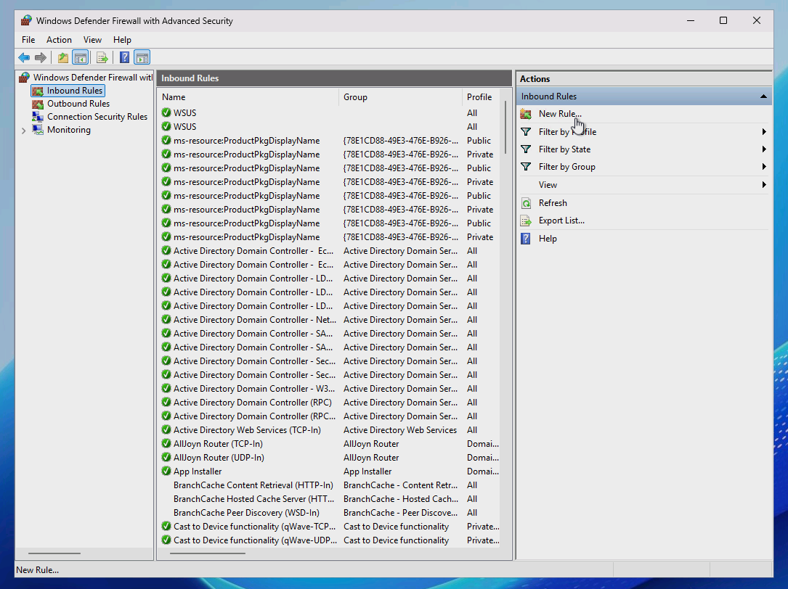
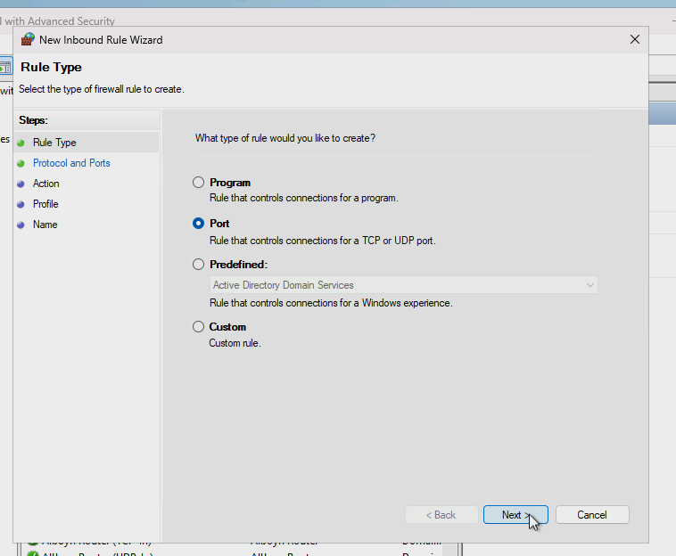
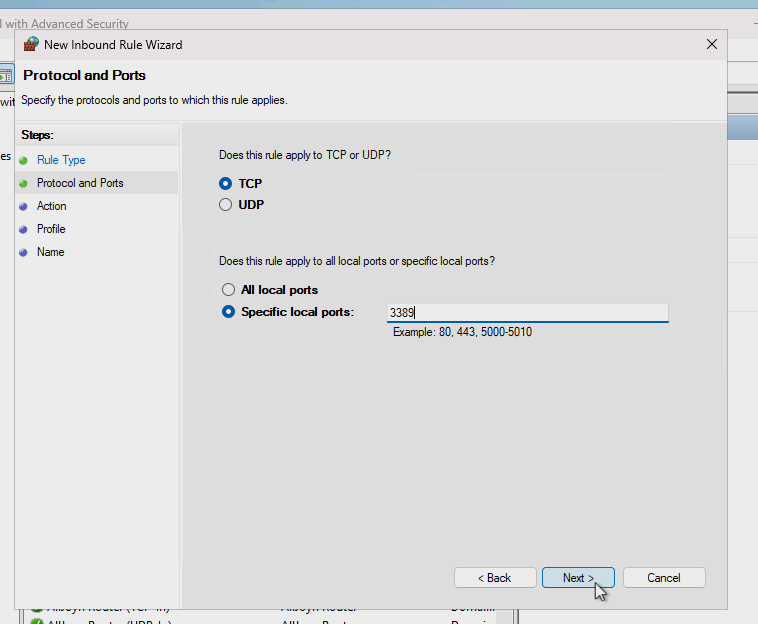
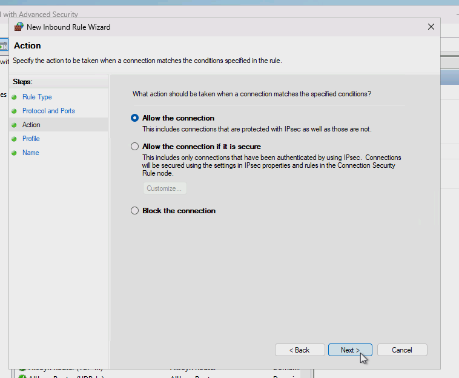
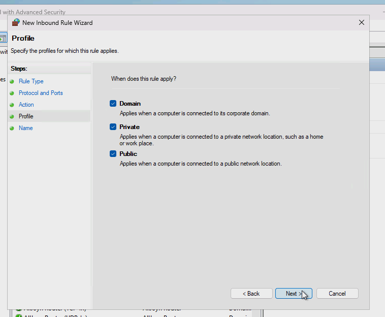
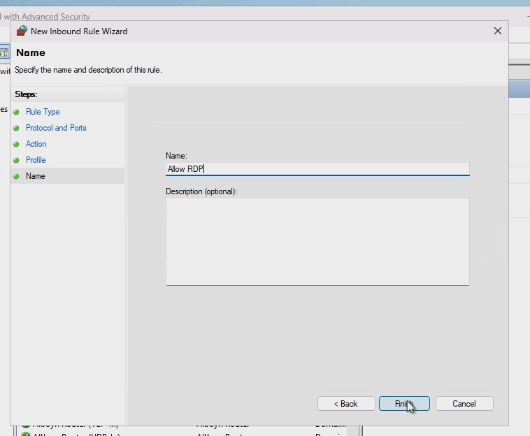
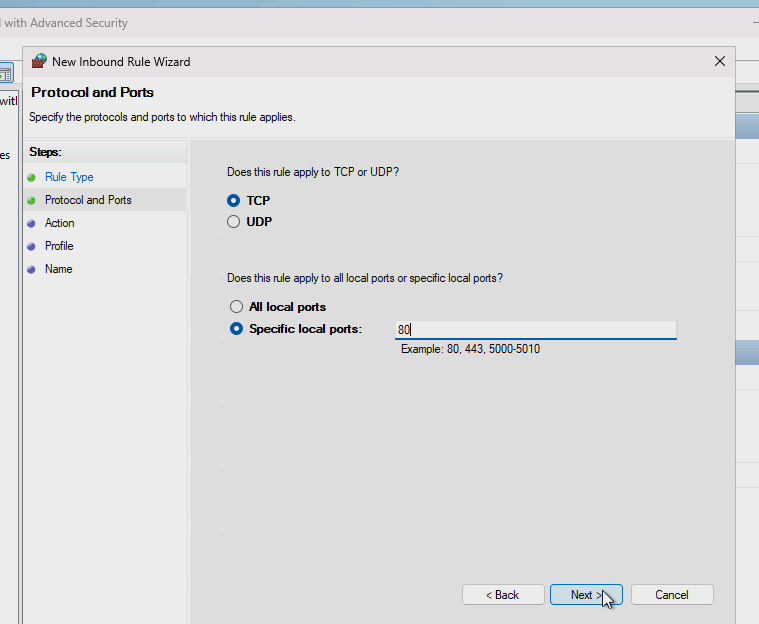
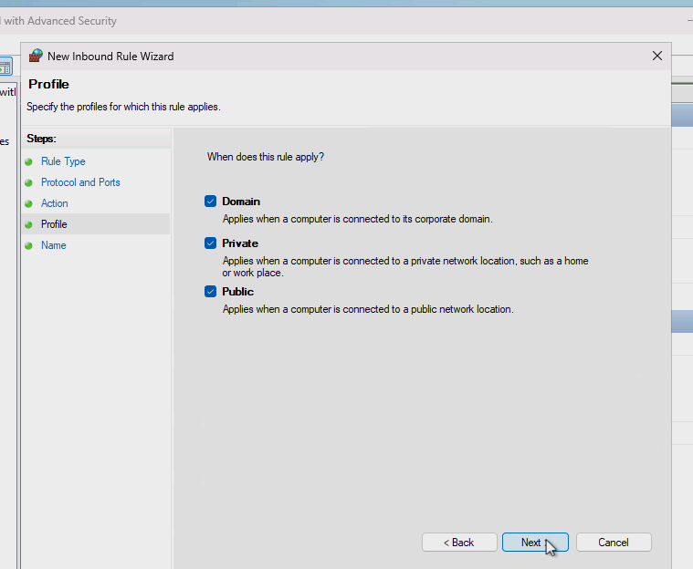
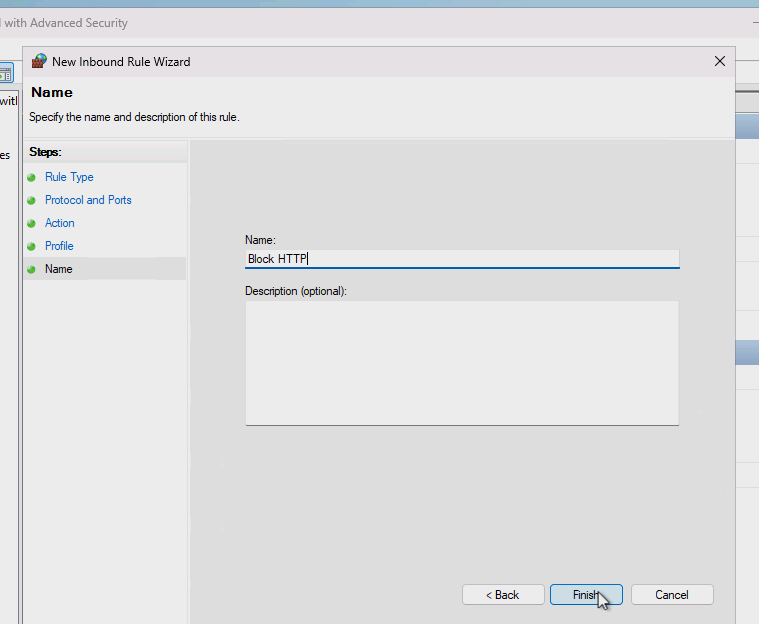
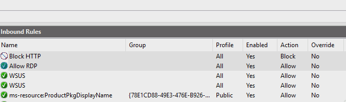

# Adding and Configuring Firewall Rules

## 🚀 Skills Demonstrated
- Firewall rule creation, modification, and enforcement for inbound and outbound traffic
- Network traffic filtering and access control based on ports, protocols, and IP ranges
- Implementation of host-based firewall security using Windows Defender Firewall

---

### Allowing RDP  

   

---
---

### Blocking HTTP
Blocking any unsecured website under port 80.  

   

---
---

### The Finished Products  

