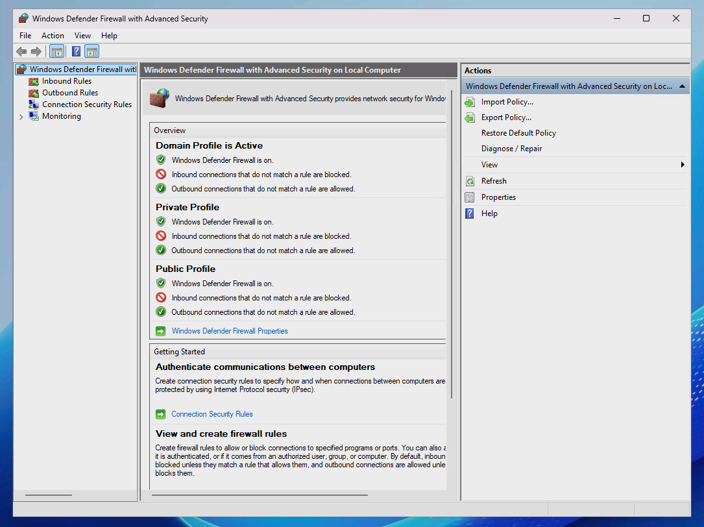
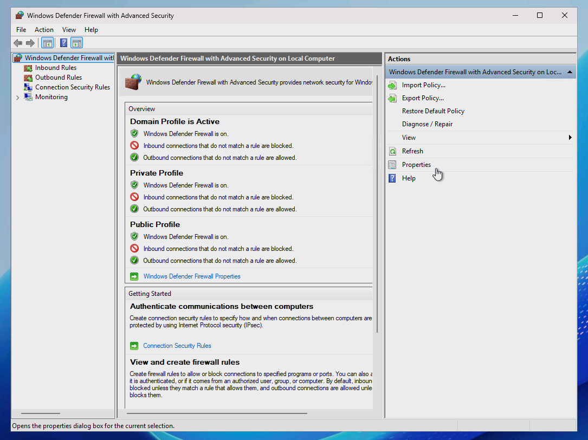
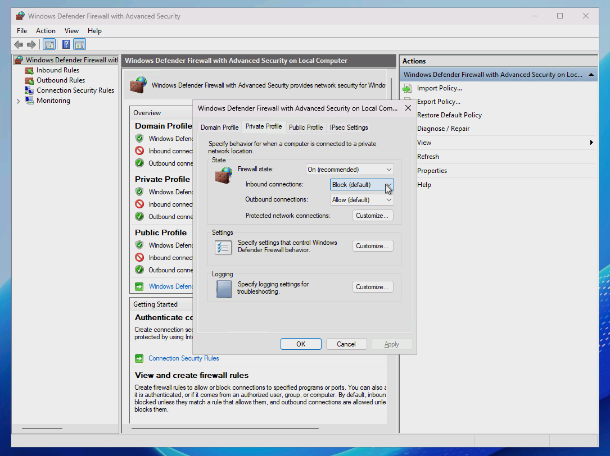
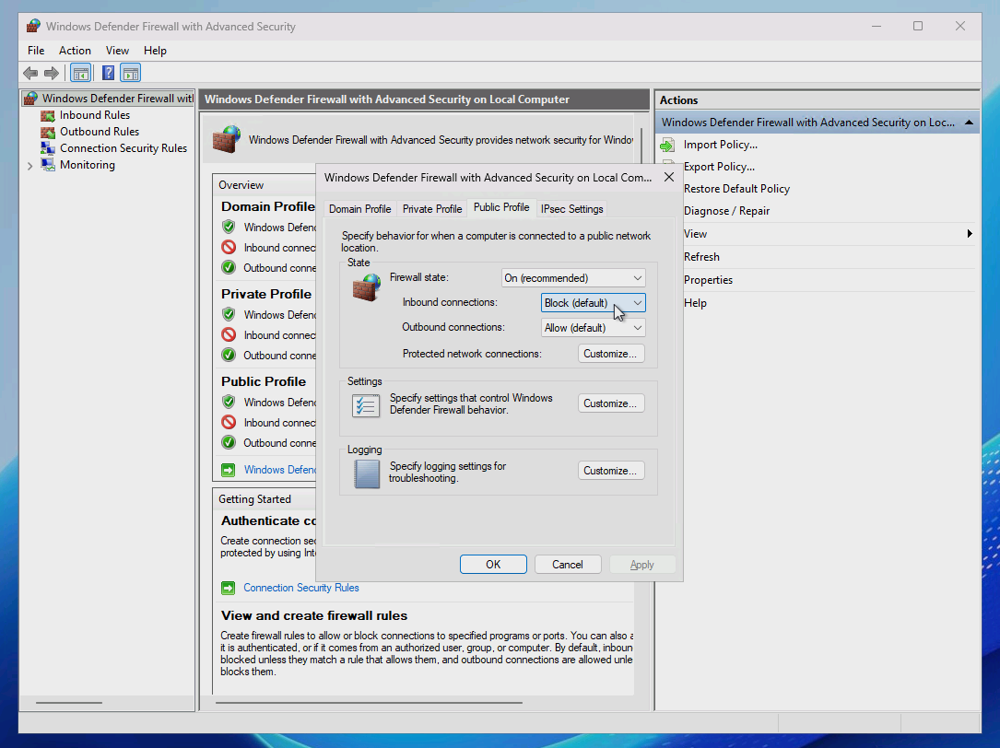
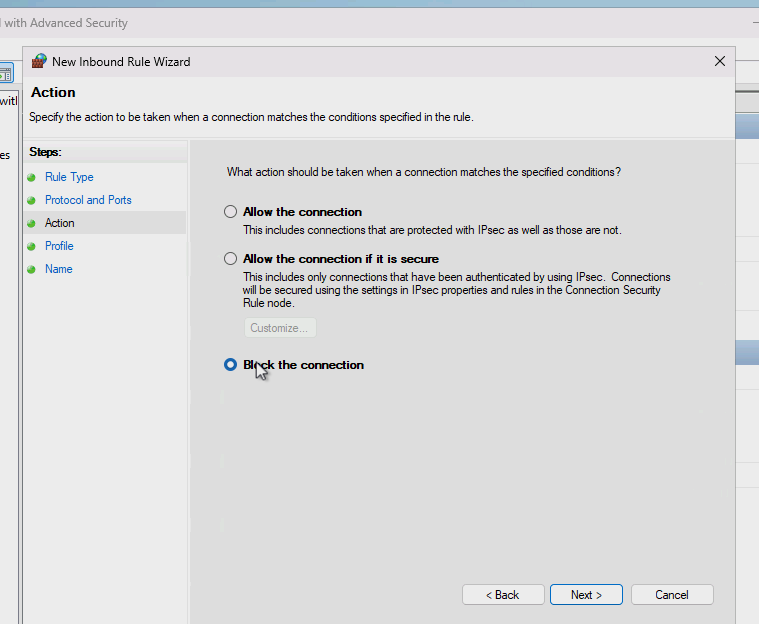

# Adding and Configuring Firewall Rules

## 🚀 Skills Demonstrated
- Firewall rule creation, modification, and enforcement for inbound and outbound traffic
- Network traffic filtering and access control based on ports, protocols, and IP ranges
- Implementation of host-based firewall security using Windows Defender Firewall

---

